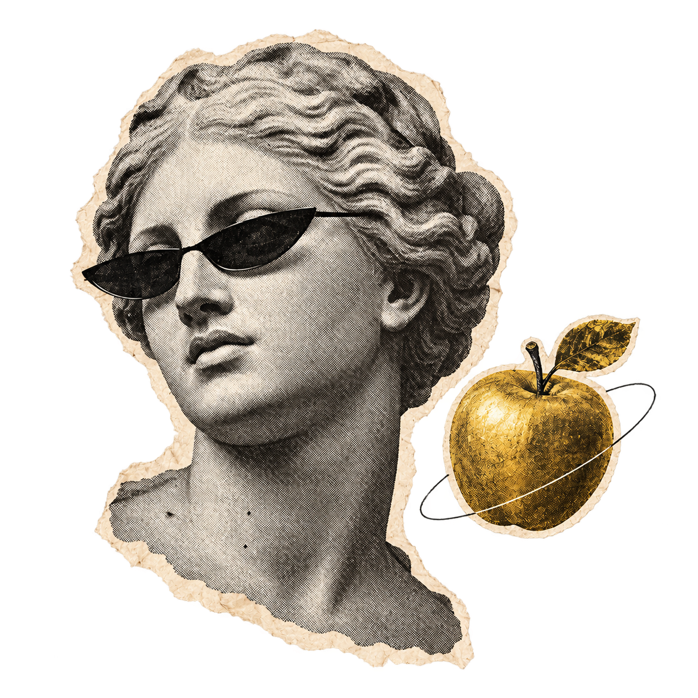
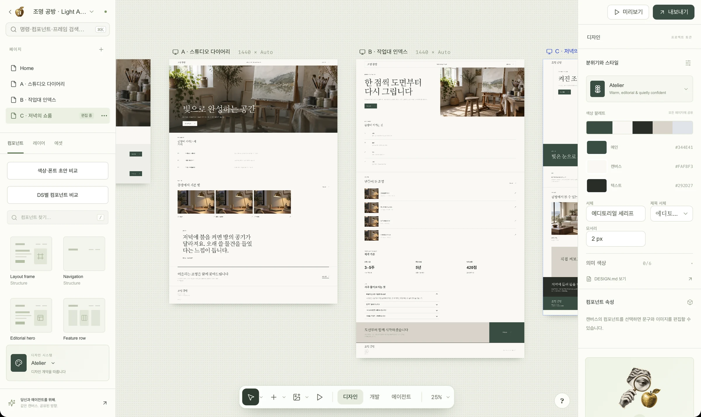
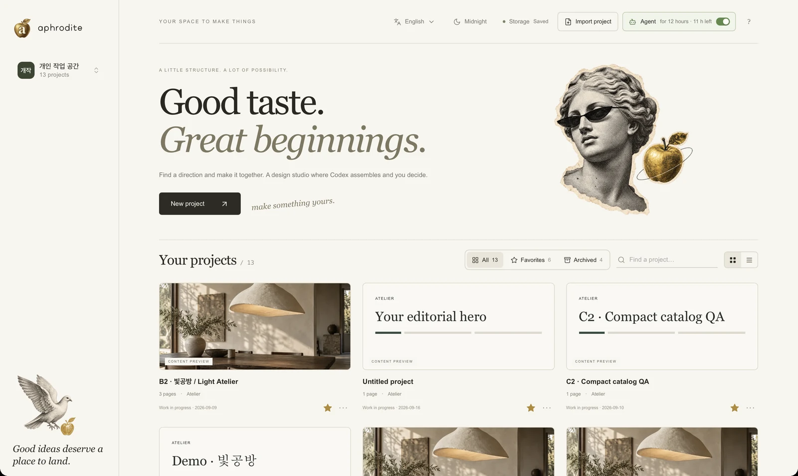
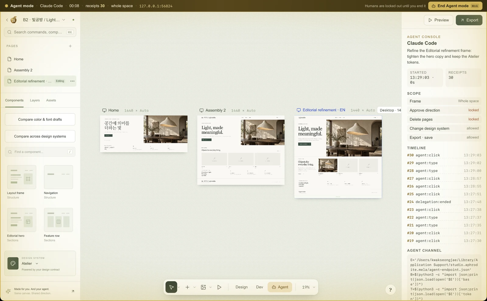
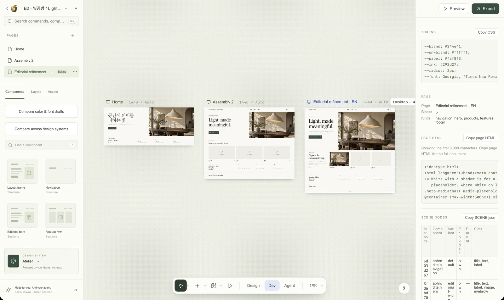

<a name="aphrodite"></a>

<p align="center">
  
</p>

<h1 align="center">Aphrodite</h1>

<p align="center"><strong>Shape before you build.</strong><br>
A local-first macOS design workbench where you settle the direction of a screen — with real components, real tokens, and an agent that can drive the same canvas you do.</p>

<p align="center">
  <a href="https://kwakseongjae.github.io/aphrodite-mela/"><b>Website</b></a> ·
  <a href="https://github.com/kwakseongjae/aphrodite-mela/releases/latest"><b>Download</b></a> ·
  <a href="docs/AGENT-CHANNEL.md">Agent channel</a> ·
  <a href="docs/COMPUTER-USE.md">Computer-use contract</a> ·
  <a href="#한국어">한국어</a>
</p>

<p align="center">
  
  
  
</p>

<p align="center">
  
</p>

---

## What it is

A coding agent can ship a page in half an hour. It can also ship the *wrong* page in half an hour. Aphrodite is where you decide the direction first, in something real enough to judge, and hand a clean contract to whoever — or whatever — builds it.

- **Local-first.** Projects live on your Mac. No account, no cloud, no generation credits. Your work never leaves the machine.
- **An open canvas.** Every page is a frame — desktop, tablet, mobile, or a custom width — laid out on one pannable, zoomable space, built from real components and design tokens. Not a mockup, not a screenshot.
- **Built for agents, too.** Real DOM, named actions, a command palette, and an **Agent mode** that hands the whole screen to a computer-use agent through a receipted channel while a human keeps approval. Same canvas, shared direction.

## Three ways to work on one canvas

<table>
<tr>
<td width="33%"></td>
<td width="33%"></td>
<td width="33%"></td>
</tr>
<tr>
<td><b>Home</b> — every project as a card with a live preview, favourites, archive, and a brand kit for the studio itself.</td>
<td><b>Agent mode</b> — delegate the same UI to an agent with a scope you choose; every edit is receipted, approval stays yours.</td>
<td><b>Dev mode</b> — a read-only handoff: component identity, tokens as CSS, rendered markup, a prompt for a coding agent.</td>
</tr>
</table>

## Download

Grab the latest signed, notarized build for macOS 13 or later — Apple Silicon and Intel:

**→ [github.com/kwakseongjae/aphrodite-mela/releases/latest](https://github.com/kwakseongjae/aphrodite-mela/releases/latest)**

Open the DMG, drag **Aphrodite** into Applications, and launch it. First run walks you through a language choice, a sample project, and a two-minute tour of the editor.

## How it works

1. **Set the direction.** Start from a brief, or drop in a reference. On macOS, Apple Vision reads the copy and layout on-device; local pixel analysis proposes colours and image regions.
2. **Make it tangible.** Assemble real components on the open canvas. Spread three directions side by side as proposal frames, swap design systems, edit copy and images, keep desktop and mobile in view. Every step is undoable.
3. **Make it real.** Approve the direction and export a contract — `PROMPT.md`, `DESIGN.md`, `tokens.json`, the rendered HTML, uploaded images, and a project file — everything Codex or Claude Code needs to build exactly what you approved.

## Agent mode

Start Agent mode and the app locks itself for people: a golden shield covers the window, a one-line banner names the operator, and clicks and keys stop responding. The agent drives through a channel instead of the mouse — a loopback HTTP endpoint in the desktop app, or `window.aphroditeAgent` in a browser build — so *the agent, and only the agent, is in control* until a human ends it with **⌘⇧A** or the banner button. Every command is receipted and the approval lock still holds. See **[docs/AGENT-CHANNEL.md](docs/AGENT-CHANNEL.md)**.

## Build from source

Requires Node 22.12+, the Rust/Tauri toolchain, and (for the on-device OCR helper) the macOS Swift compiler. OCR is macOS-only.

```sh
npm install
npm run dev          # browser build at http://127.0.0.1:1420
npm run desktop      # Tauri dev app (HMR)
./script/build_and_run.sh   # release build + launch (Codex's Run button uses this too)
```

Checks and a release build:

```sh
npm test
npm run build
cargo check --manifest-path src-tauri/Cargo.toml
npm run desktop:build   # → src-tauri/target/release/bundle/macos/Aphrodite.app
```

Distribution signing and notarization run in the GitHub Actions release workflow when the signing secrets are present; tagging `v*` produces the DMGs attached to a release.

## Under the hood

- **Tauri 2** (WKWebView) shell, a **Vite + TypeScript** frontend, and Rust commands for the local workspace, the project file vault, the Vision OCR sidecar, and the agent channel.
- Components render in sandboxed iframes; official design-system adapters (MUI, Astryx, SEED, shadcn) sit next to Aphrodite's own patterns, all driven by one design contract.
- The studio's own look — Paper Muse — is documented in the in-app **Brand Kit** and in [docs/APHRODITE-BRAND.md](docs/APHRODITE-BRAND.md).

## License

MIT — see [LICENSE](LICENSE). Sculpture and collage assets and other third-party references are credited in [THIRD_PARTY_NOTICES.md](THIRD_PARTY_NOTICES.md).

<br>

---

<a name="한국어"></a>

<p align="center">
  
</p>

<h1 align="center">Aphrodite · 한국어</h1>

<p align="center"><strong>만들기 전에, 방향부터.</strong><br>
실제 컴포넌트와 토큰으로 화면의 방향을 먼저 정하고, 당신과 같은 캔버스를 에이전트도 조작할 수 있는 로컬 우선 macOS 디자인 워크벤치.</p>

<p align="center">
  <a href="https://kwakseongjae.github.io/aphrodite-mela/"><b>웹사이트</b></a> ·
  <a href="https://github.com/kwakseongjae/aphrodite-mela/releases/latest"><b>다운로드</b></a> ·
  <a href="docs/AGENT-CHANNEL.md">에이전트 채널</a> ·
  <a href="#aphrodite">English</a>
</p>

### 무엇인가

코딩 에이전트는 30분이면 페이지 하나를 만듭니다. 하지만 30분이면 *잘못된* 페이지도 만듭니다. Aphrodite는 판단할 수 있을 만큼 실제에 가까운 화면에서 방향을 먼저 정하고, 그것을 만드는 사람에게 — 혹은 에이전트에게 — 깔끔한 계약으로 넘기는 곳입니다.

- **로컬 우선.** 프로젝트는 이 Mac에 저장됩니다. 계정도, 클라우드도, 생성 크레딧도 없습니다. 작업이 기기를 떠나지 않습니다.
- **열린 캔버스.** 모든 페이지가 프레임입니다. 데스크톱·태블릿·모바일·사용자 지정 너비를, 이동하고 확대할 수 있는 하나의 공간 위에 실제 컴포넌트와 디자인 토큰으로 배치합니다. 목업도, 스크린샷도 아닙니다.
- **에이전트를 위한 설계.** 실제 DOM, 이름 있는 동작, 명령 팔레트, 그리고 **에이전트 모드**. 화면 전체를 컴퓨터 유즈 에이전트에게 영수증이 남는 채널로 위임하되, 승인은 사람이 쥡니다. 같은 캔버스, 공유된 방향.

### 다운로드

macOS 13 이상용 서명·공증된 최신 빌드(Apple Silicon·Intel):

**→ [github.com/kwakseongjae/aphrodite-mela/releases/latest](https://github.com/kwakseongjae/aphrodite-mela/releases/latest)**

DMG를 열고 **Aphrodite**를 Applications로 끌어다 놓은 뒤 실행하세요. 첫 실행에서 언어 선택, 샘플 프로젝트, 2분짜리 에디터 둘러보기를 안내합니다.

### 작동 방식

1. **방향 잡기.** 브리프로 시작하거나 레퍼런스를 넣습니다. macOS에서는 Apple Vision이 기기 안에서 문구와 배치를 읽고, 로컬 픽셀 분석이 색과 이미지 영역을 제안합니다.
2. **손에 잡히게.** 열린 캔버스에서 실제 컴포넌트로 조립합니다. 세 방향을 제안 프레임으로 나란히 펼치고, 디자인 시스템을 바꾸고, 문구와 이미지를 고치고, 데스크톱과 모바일을 한눈에 보세요. 모든 단계는 되돌릴 수 있습니다.
3. **실제로 만들기.** 방향을 승인하고 계약을 내보냅니다. `PROMPT.md`, `DESIGN.md`, `tokens.json`, 렌더된 HTML, 업로드한 이미지, 프로젝트 파일까지 — Codex나 Claude Code가 승인한 그대로 구현하는 데 필요한 모든 것.

### 에이전트 모드

에이전트 모드를 켜면 앱이 사람에게는 잠깁니다. 황금색 음영이 창을 덮고, 한 줄 배너가 조작 주체를 알리며, 클릭과 키가 반응하지 않습니다. 에이전트는 마우스가 아니라 채널로 조작합니다 — 데스크톱 앱의 로컬 HTTP 엔드포인트, 또는 브라우저 빌드의 `window.aphroditeAgent`. 그래서 사람이 **⌘⇧A** 또는 배너 버튼으로 끄기 전까지 *에이전트가, 에이전트만이* 제어합니다. 모든 명령은 영수증으로 남고 승인 잠금은 그대로입니다. **[docs/AGENT-CHANNEL.md](docs/AGENT-CHANNEL.md)** 참고.

### 소스에서 빌드

Node 22.12+, Rust/Tauri 툴체인, (기기 내 OCR 도우미용) macOS Swift 컴파일러가 필요합니다. OCR은 macOS 전용입니다.

```sh
npm install
npm run dev          # 브라우저 빌드 http://127.0.0.1:1420
npm run desktop      # Tauri 개발 앱 (HMR)
./script/build_and_run.sh   # 릴리스 빌드 + 실행
```

배포 서명·공증은 시크릿이 있을 때 GitHub Actions 릴리스 워크플로에서 수행되며, `v*` 태그를 밀면 릴리스에 DMG가 첨부됩니다.

### 라이선스

MIT — [LICENSE](LICENSE) 참고. 조각·콜라주 에셋과 기타 서드파티 참조는 [THIRD_PARTY_NOTICES.md](THIRD_PARTY_NOTICES.md)에 표기했습니다.
