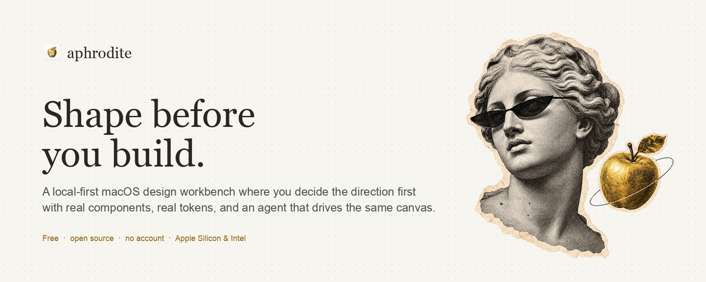

<h1 align="center">Aphrodite: shape before you build</h1>

<p align="center">
  
</p>

<p align="center">
  <a href="https://kwakseongjae.github.io/aphrodite-mela/">Website</a> ·
  <a href="https://github.com/kwakseongjae/aphrodite-mela/releases/latest">Download</a> ·
  <a href="docs/QUICKSTART.md">Quick start</a> ·
  <a href="docs/AGENT-CHANNEL.md">Agent channel</a> ·
  <a href="docs/COMPUTER-USE.md">Computer-use contract</a> ·
  <a href="docs/RELEASE-NOTES-v0.1.5.md">Release notes</a>
</p>

<p align="center">
  <a href="https://github.com/kwakseongjae/aphrodite-mela/releases"></a>
  <a href="LICENSE"></a>
  
  
  <a href="docs/QUICKSTART.md"></a>
</p>

<p align="center"><b>English</b> · <a href="docs/i18n/README.ko.md">한국어</a></p>

---

## What is Aphrodite

🖥️ **Local-first native macOS app.** &nbsp;🧱 **Real components and design tokens on an open canvas.** &nbsp;🤖 **An Agent mode that hands the screen to a computer-use agent — with receipts, scope, and a human approval lock.** &nbsp;📦 **Exports a build contract: `PROMPT.md`, `DESIGN.md`, `tokens.json`, rendered HTML.**

A coding agent can ship a page in half an hour. It can also ship the *wrong* page in half an hour — wrong layout, wrong tone, a hero nobody asked for — and you find out at the end. Aphrodite is the step before that: a workbench where you settle the **direction** of a screen in something real enough to judge, then hand a clean contract to whoever, or whatever, builds it.

It is not a mockup tool and not a screenshot generator. Every page is a frame on one pannable, zoomable **Space**, built from real components (Aphrodite's own patterns plus MUI, Astryx, SEED and shadcn adapters) driven by one design contract. Nothing leaves your Mac: no account, no cloud, no generation credits.

---

## Product tour

<table>
<tr>
<td valign="top">
<br>
<sub><b>The Space</b> — pages are frames (desktop 1440 · tablet 834 · mobile 390 · custom) on one open canvas. Pan with Space+drag or the wheel, zoom with ⌘wheel, ⇧1 fits everything. The floating dock holds the tools and the Design · Dev · Agent modes.</sub>
</td>
</tr>
</table>

<table>
<tr>
<td width="33%" valign="top">
<br>
<sub><b>Home</b> — every project as a card with a live preview. Favourites, archive, right-click menus, last-opened first, and a brand kit for the studio itself.</sub>
</td>
<td width="33%" valign="top">
<br>
<sub><b>Agent mode</b> — the agent takes the screen through a receipted channel while people are locked out. Scope is yours, approval is yours, and ⌘⇧A gives it back.</sub>
</td>
<td width="33%" valign="top">
<br>
<sub><b>Dev mode</b> — a read-only handoff: component identity, tokens as CSS, rendered markup, page HTML, SCENE nodes and a prompt for a coding agent. Copy what you need.</sub>
</td>
</tr>
</table>

---

## Works with your agent

Aphrodite does not ship a model. The agent already on your machine drives it — from the screen while a human is in charge, and through the **agent channel** once Agent mode hands the screen over.

| Agent | How it drives Aphrodite | Status |
|---|---|:---:|
| [Claude Code](https://docs.anthropic.com/en/docs/claude-code) | Shell → `curl` the loopback channel; reads the exported contract | ✅ |
| [Codex CLI](https://github.com/openai/codex) | Shell → channel; Codex's **Run** uses `script/build_and_run.sh` | ✅ |
| Astra / computer-use agents | Screen and pointer before Agent mode; channel (shell) during it | ✅ |
| Cursor, Copilot CLI, any CLI with a shell | `curl` the channel, or open the export ZIP | ✅ |
| Browser harnesses (CDP, Playwright) | `window.aphroditeAgent.run()` in the web build | ✅ |

The contract for agents — stable `data-action` names, `#app[data-*]` state, the command palette, and what is refused while delegated — lives in [docs/COMPUTER-USE.md](docs/COMPUTER-USE.md). The channel routes (`state / command / act / click / edit / type / key / end`) are in [docs/AGENT-CHANNEL.md](docs/AGENT-CHANNEL.md).

---

## How it works

**1 · Set the direction.** Start from a brief, or drop in a reference. On macOS, Apple Vision reads the copy and layout on-device; local pixel analysis proposes colours and image regions. Nothing is uploaded.

**2 · Make it tangible.** Assemble real components on the Space. Spread three directions side by side as proposal frames and pick one from its label. Swap design systems, edit copy and images, let Get Vibe fill sample content, keep desktop and mobile in view. Every step is undoable and receipted.

**3 · Make it real.** Approve the direction — a deliberate human click that no agent can press — and export the contract: `PROMPT.md`, `DESIGN.md`, `tokens.json`, `SCENE.json`, the rendered HTML with your uploaded images, and the project file. Hand it to Codex or Claude Code and get exactly what you approved.

---

## Why Aphrodite

| | Aphrodite | Figma | Claude Design · OpenDesign | Prompting the agent directly |
|---|:---:|:---:|:---:|:---:|
| Runs on your Mac, no account, no cloud | ✅ | ✗ | partly | — |
| Real components and tokens, not pixels | ✅ | ✗ | ✅ | ✅ |
| Direction decided *before* the build | ✅ | ✅ | ✅ | ✗ |
| Three honest layout variants, side by side | ✅ | manual | ✗ | ✗ |
| Agent drives the same UI you do | ✅ | ✗ | ✗ | — |
| Human approval lock the agent cannot bypass | ✅ | — | ✗ | ✗ |
| Every agent edit receipted | ✅ | ✗ | ✗ | ✗ |
| Exports a build contract for coding agents | ✅ | ✗ | partly | — |

Aphrodite is deliberately narrow: one screen, one direction, one contract. It is the place to *decide*, not the place to generate ten options and hope.

---

## Quick start

### 🖥️ Download the app (recommended)

1. Download the DMG for your Mac from the [latest release](https://github.com/kwakseongjae/aphrodite-mela/releases/latest) — Apple Silicon (`_aarch64.dmg`) or Intel (`_x64.dmg`). Signed with a Developer ID and notarized; macOS 13 or later.
2. Open the DMG and drag **Aphrodite** into **Applications**.
3. Launch it. First run offers English or Korean, a **sample project** (a small lighting brand with a desktop and a mobile frame) or a blank one, and a two-minute tour of the editor.

Five minutes from there — reference → three directions → pick → Get Vibe → edit → approve → export — is walked through in [docs/QUICKSTART.md](docs/QUICKSTART.md).

### 🧑‍💻 Run from source

```sh
git clone https://github.com/kwakseongjae/aphrodite-mela.git
cd aphrodite-mela
npm install
npm run desktop           # Tauri dev app with HMR (vite on 127.0.0.1:1420)
```

Node 22.12+, the Rust/Tauri toolchain, and the macOS Swift compiler (for the on-device OCR sidecar) are required. Everything else — tests, release builds, the headless verification harness, signing and the release process — is in [docs/DEVELOPMENT.md](docs/DEVELOPMENT.md).

---

## Use Aphrodite from your coding agent

Start Agent mode in the app (dock → **Agent**, or key `3`). A golden shield locks the window for people; the app writes `~/Library/Application Support/studio.aphrodite.mela/agent-endpoint.json` with a loopback port and a bearer token, and the agent console shows ready-made curl lines.

```sh
E=$(cat ~/Library/Application\ Support/studio.aphrodite.mela/agent-endpoint.json)
BASE=$(echo "$E" | python3 -c 'import json,sys;print(json.load(sys.stdin)["base"])')
TOKEN=$(echo "$E" | python3 -c 'import json,sys;print(json.load(sys.stdin)["token"])')
H=(-H "Authorization: Bearer $TOKEN" -H 'Content-Type: application/json')

curl -s "$BASE/agent/state" "${H[@]}"                                                   # what is on screen
curl -s -X POST "$BASE/agent/command" "${H[@]}" -d '{"query":"features 추가"}'           # run a palette command
curl -s -X POST "$BASE/agent/click"   "${H[@]}" -d '{"selector":".space-frame.active [data-kind=hero]"}'
curl -s -X POST "$BASE/agent/edit"    "${H[@]}" -d '{"field":"title","text":"Light, made meaningful"}'
curl -s -X POST "$BASE/agent/key"     "${H[@]}" -d '{"key":"1","shift":true}'            # fit all frames
curl -s -X POST "$BASE/agent/end"     "${H[@]}"
```

Every command lands as a receipt in the run log. **Approve direction** is refused over the channel by design; scope (this frame only, delete pages, change design system, export) is what the human set when handing over. Details: [docs/AGENT-CHANNEL.md](docs/AGENT-CHANNEL.md).

---

## Architecture

```
aphrodite-mela/
├── src/                      Vite + TypeScript frontend (single-page workbench)
│   ├── main.ts               render loop, action dispatcher, the Space, modes, agent gate
│   ├── editor/               dock, command palette, pointer editor, space (camera + frames), menus
│   ├── agent/                delegation record, proposals, agent channel executor
│   ├── design/               brand kit, catalog view, onboarding tour, custom menus
│   ├── vendor/               MUI · Astryx · SEED · shadcn adapters in sandboxed iframes
│   ├── workspace/            home, library, vault, onboarding
│   └── export.ts             PROMPT.md · DESIGN.md · tokens.json · HTML · uploads → ZIP
├── src-tauri/                Rust shell (Tauri 2)
│   └── src/{workspace,vault,reference,agent}.rs   disk workspace · project vault · Vision OCR · agent bridge
├── site/                     the landing page (GitHub Pages)
├── docs/                     contracts, release notes, roadmap, validation evidence
└── tests/                    node:test suites (169) — model, export, palette, space, delegation, onboarding, …
```

The frontend owns the model; Rust owns the disk. Projects are JSON in a versioned workspace file with a per-project vault of snapshots and documents. The Vision OCR helper is a signed sidecar so notarization holds.

---

## Roadmap & status

Aphrodite is an early beta, built in the open by one person with a fleet of agents. The canonical execution order and every checkpoint since the first signed build are in [docs/BETA-ROADMAP.md](docs/BETA-ROADMAP.md). Next on the list: the catalog and shelf rework (drag from the panel straight onto a frame), viewport-only rendering for large spaces, a universal build, and auto-update.

Contributions are not being taken yet — the shape is still moving too fast — but issues and questions are welcome.

---

## Documentation

| Doc | What it is for |
|---|---|
| [QUICKSTART.md](docs/QUICKSTART.md) | Install, first run, a five-minute first project, shortcuts, troubleshooting |
| [DEVELOPMENT.md](docs/DEVELOPMENT.md) | Toolchain, scripts, tests, headless verification, signing, release process |
| [COMPUTER-USE.md](docs/COMPUTER-USE.md) | The contract for agents driving the UI: actions, state, palette, delegation rules |
| [AGENT-CHANNEL.md](docs/AGENT-CHANNEL.md) | The loopback channel and `window.aphroditeAgent` |
| [DEMO-ASTRA-5MIN.md](docs/DEMO-ASTRA-5MIN.md) | A scripted five-minute demo for a computer-use agent |
| [APHRODITE-BRAND.md](docs/APHRODITE-BRAND.md) | Paper Muse — the studio's own identity (also in-app as the Brand Kit) |
| [RELEASE-NOTES-v0.1.5.md](docs/RELEASE-NOTES-v0.1.5.md) | What changed, release by release |

---

## License, credits & lineage

MIT — see [LICENSE](LICENSE).

The muse is a newspaper-collage treatment of SMK's open plaster cast of the Venus de Milo; the sculpture edition and photography sources, the oh-my-design token observations, and the OpenDesign workflow reference are credited in [THIRD_PARTY_NOTICES.md](THIRD_PARTY_NOTICES.md). [OpenDesign](https://github.com/nexu-io/open-design) shaped the *agent-native, local-first* framing; Aphrodite takes the opposite bet on scope — decide one screen well, then hand it off.

<p align="center"><sub>Made with intention. A little instinct, too.</sub></p>
