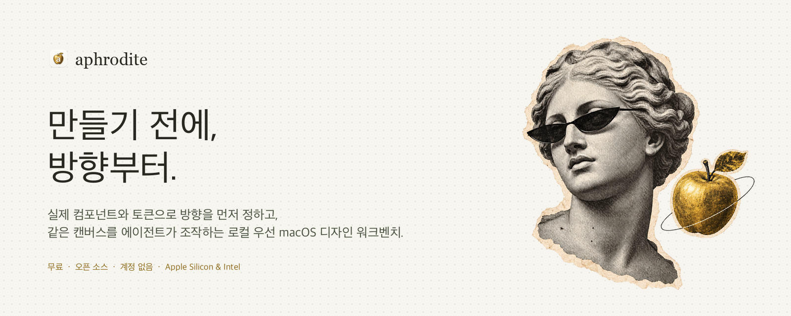
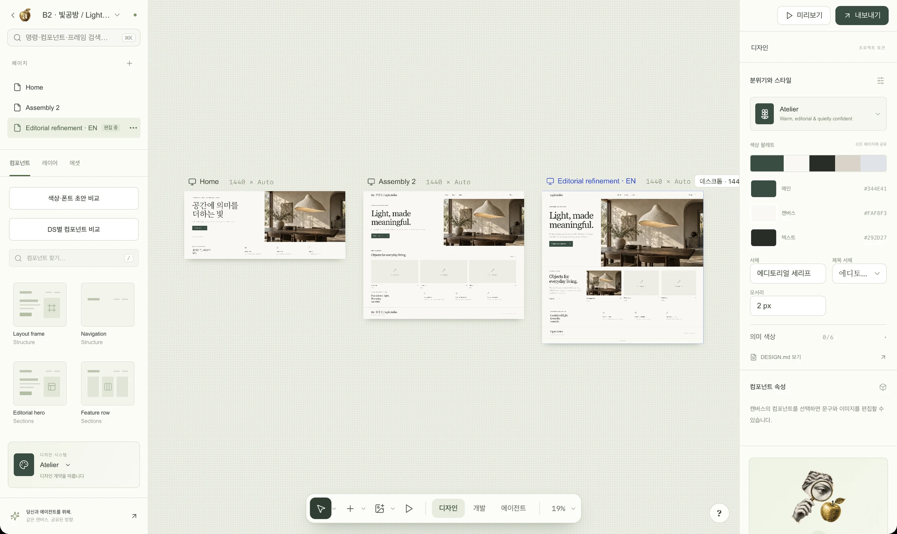
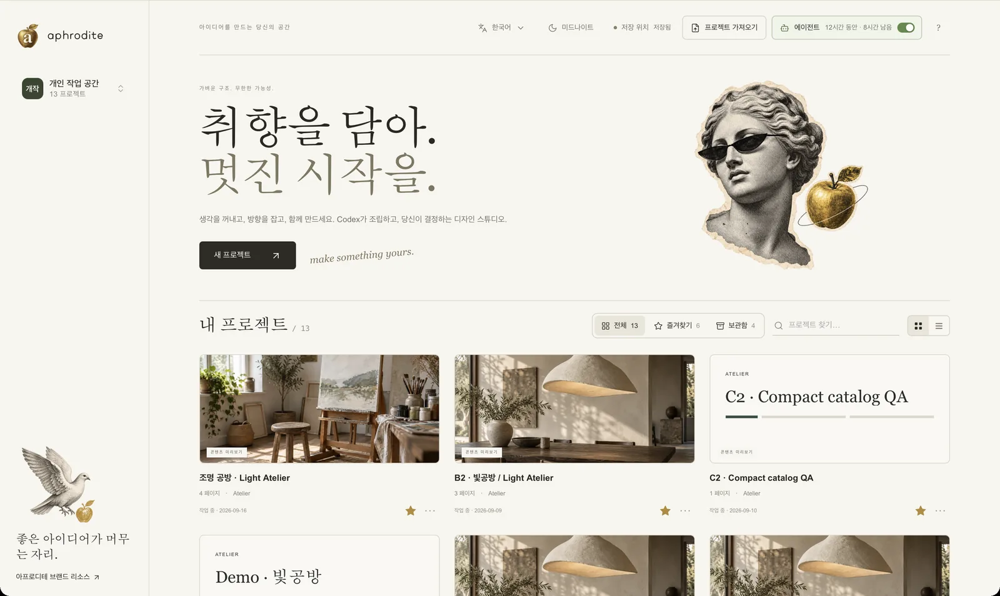
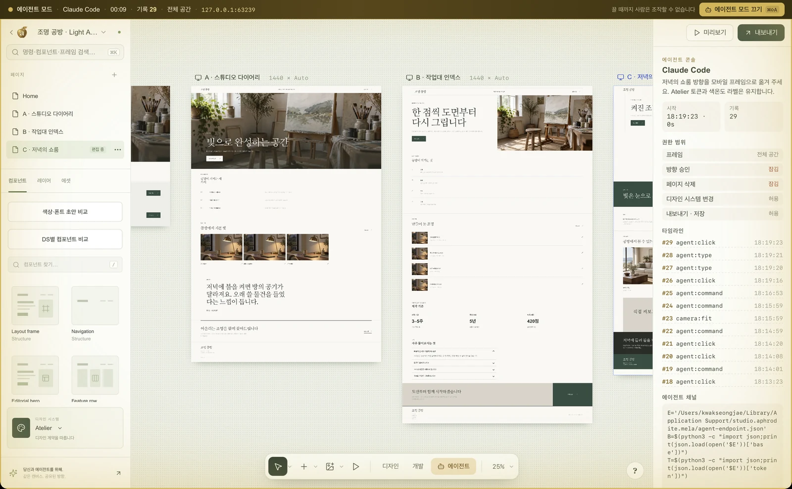
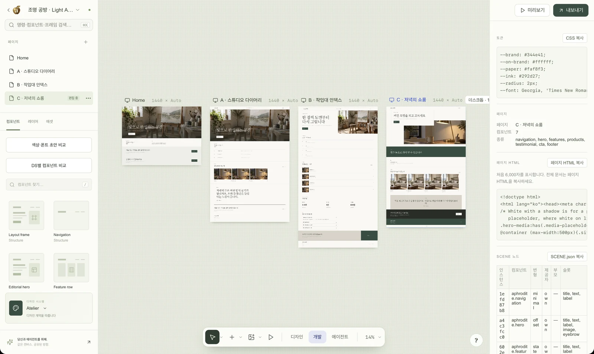

<h1 align="center">Aphrodite: 만들기 전에, 방향부터</h1>

<p align="center">
  
</p>

<p align="center">
  <a href="https://kwakseongjae.github.io/aphrodite-mela/">웹사이트</a> ·
  <a href="https://github.com/kwakseongjae/aphrodite-mela/releases/latest">다운로드</a> ·
  <a href="../QUICKSTART.md">빠른 시작</a> ·
  <a href="../AGENT-CHANNEL.md">에이전트 채널</a> ·
  <a href="../COMPUTER-USE.md">컴퓨터 유즈 계약</a> ·
  <a href="../RELEASE-NOTES-v0.1.5.md">릴리스 노트</a>
</p>

<p align="center">
  <a href="https://github.com/kwakseongjae/aphrodite-mela/releases"></a>
  <a href="../../LICENSE"></a>
  
  
</p>

<p align="center"><a href="../../README.md">English</a> · <b>한국어</b></p>

---

## Aphrodite는 무엇인가

🖥️ **로컬 우선 macOS 네이티브 앱.** &nbsp;🧱 **열린 캔버스 위의 실제 컴포넌트와 디자인 토큰.** &nbsp;🤖 **화면을 컴퓨터 유즈 에이전트에게 맡기는 에이전트 모드 — 영수증, 범위, 그리고 사람만 누를 수 있는 승인.** &nbsp;📦 **빌드 계약을 내보냅니다: `PROMPT.md`, `DESIGN.md`, `tokens.json`, 렌더된 HTML.**

코딩 에이전트는 30분이면 페이지 하나를 만듭니다. 30분이면 *잘못된* 페이지도 만듭니다 — 엉뚱한 레이아웃, 다른 톤, 아무도 요청하지 않은 히어로 — 그리고 그걸 마지막에야 알게 됩니다. Aphrodite는 그 앞 단계입니다. 판단할 수 있을 만큼 실제에 가까운 화면에서 **방향**을 정하고, 그것을 만드는 사람에게 — 혹은 에이전트에게 — 깔끔한 계약으로 넘기는 작업대입니다.

목업 도구도, 스크린샷 생성기도 아닙니다. 모든 페이지는 이동하고 확대할 수 있는 하나의 **스페이스** 위 프레임이며, 하나의 디자인 계약이 이끄는 실제 컴포넌트(Aphrodite 자체 패턴과 MUI·Astryx·SEED·shadcn 어댑터)로 조립됩니다. 어떤 것도 Mac을 떠나지 않습니다. 계정도, 클라우드도, 생성 크레딧도 없습니다.

---

## 둘러보기

<table>
<tr>
<td valign="top">
<br>
<sub><b>스페이스</b> — 페이지는 하나의 열린 캔버스 위 프레임입니다(데스크톱 1440 · 태블릿 834 · 모바일 390 · 사용자 지정). Space+드래그나 휠로 이동, ⌘휠로 줌, ⇧1로 전체 보기. 플로팅 독에 도구와 디자인 · 개발 · 에이전트 모드가 있습니다.</sub>
</td>
</tr>
</table>

<table>
<tr>
<td width="33%" valign="top">
<br>
<sub><b>홈</b> — 모든 프로젝트를 실시간 미리보기 카드로. 즐겨찾기, 보관함, 우클릭 메뉴, 최근 연 순서, 그리고 스튜디오 자체의 브랜드 리소스.</sub>
</td>
<td width="33%" valign="top">
<br>
<sub><b>에이전트 모드</b> — 사람은 잠기고, 에이전트가 영수증이 남는 채널로 화면을 가져갑니다. 범위도 승인도 당신 몫이며, ⌘⇧A로 되찾습니다.</sub>
</td>
<td width="33%" valign="top">
<br>
<sub><b>개발 모드</b> — 읽기 전용 핸드오프: 컴포넌트 식별자, CSS 토큰, 렌더된 마크업, 페이지 HTML, SCENE 노드, 코딩 에이전트용 프롬프트. 필요한 것만 복사하세요.</sub>
</td>
</tr>
</table>

---

## 당신의 에이전트와 함께

Aphrodite는 모델을 내장하지 않습니다. 이미 당신 기기에 있는 에이전트가 조작합니다 — 사람이 주도하는 동안은 화면에서, 에이전트 모드가 화면을 넘긴 뒤에는 **에이전트 채널**로.

| 에이전트 | 조작 방식 | 상태 |
|---|---|:---:|
| [Claude Code](https://docs.anthropic.com/en/docs/claude-code) | 셸 → 로컬 채널에 `curl`; 내보낸 계약을 읽음 | ✅ |
| [Codex CLI](https://github.com/openai/codex) | 셸 → 채널; Codex의 **Run**은 `script/build_and_run.sh`를 사용 | ✅ |
| Astra · 컴퓨터 유즈 에이전트 | 에이전트 모드 전에는 화면과 포인터, 에이전트 모드 중에는 채널(셸) | ✅ |
| Cursor, Copilot CLI, 셸이 있는 모든 CLI | 채널에 `curl`, 또는 내보낸 ZIP 열기 | ✅ |
| 브라우저 하네스(CDP, Playwright) | 웹 빌드의 `window.aphroditeAgent.run()` | ✅ |

에이전트용 계약 — 안정적인 `data-action` 이름, `#app[data-*]` 상태, 명령 팔레트, 위임 중 거부되는 동작 — 은 [COMPUTER-USE.md](../COMPUTER-USE.md)에, 채널 라우트(`state / command / act / click / edit / type / key / end`)는 [AGENT-CHANNEL.md](../AGENT-CHANNEL.md)에 있습니다.

---

## 작동 방식

**1 · 방향 잡기.** 브리프로 시작하거나 레퍼런스를 넣습니다. macOS에서는 Apple Vision이 기기 안에서 문구와 배치를 읽고, 로컬 픽셀 분석이 색과 이미지 영역을 제안합니다. 아무것도 업로드되지 않습니다.

**2 · 손에 잡히게.** 스페이스 위에서 실제 컴포넌트로 조립합니다. 세 방향을 제안 프레임으로 나란히 펼치고 라벨에서 하나를 고릅니다. 디자인 시스템을 바꾸고, 문구와 이미지를 고치고, Get Vibe로 샘플 콘텐츠를 채우고, 데스크톱과 모바일을 한눈에 봅니다. 모든 단계는 되돌릴 수 있고 영수증으로 남습니다.

**3 · 실제로 만들기.** 방향을 승인합니다 — 어떤 에이전트도 누를 수 없는, 사람의 의도적인 클릭입니다 — 그리고 계약을 내보냅니다: `PROMPT.md`, `DESIGN.md`, `tokens.json`, `SCENE.json`, 업로드한 이미지가 포함된 렌더된 HTML, 프로젝트 파일. Codex나 Claude Code에 넘기면 승인한 그대로 만들어집니다.

---

## 왜 Aphrodite인가

| | Aphrodite | Figma | Claude Design · OpenDesign | 에이전트에 바로 프롬프트 |
|---|:---:|:---:|:---:|:---:|
| Mac에서 실행, 계정·클라우드 없음 | ✅ | ✗ | 일부 | — |
| 픽셀이 아닌 실제 컴포넌트와 토큰 | ✅ | ✗ | ✅ | ✅ |
| 빌드 *전에* 방향을 결정 | ✅ | ✅ | ✅ | ✗ |
| 정직한 배치 변형 세 개를 나란히 | ✅ | 수동 | ✗ | ✗ |
| 에이전트가 사람과 같은 UI를 조작 | ✅ | ✗ | ✗ | — |
| 에이전트가 우회할 수 없는 사람의 승인 잠금 | ✅ | — | ✗ | ✗ |
| 에이전트의 모든 편집이 영수증으로 | ✅ | ✗ | ✗ | ✗ |
| 코딩 에이전트용 빌드 계약 내보내기 | ✅ | ✗ | 일부 | — |

Aphrodite는 일부러 좁습니다. 화면 하나, 방향 하나, 계약 하나. 열 가지 안을 뽑아 놓고 고르는 곳이 아니라 *결정하는* 곳입니다.

---

## 빠른 시작

### 🖥️ 앱 다운로드 (권장)

1. [최신 릴리스](https://github.com/kwakseongjae/aphrodite-mela/releases/latest)에서 내 Mac에 맞는 DMG를 받습니다 — Apple Silicon(`_aarch64.dmg`) 또는 Intel(`_x64.dmg`). Developer ID로 서명·공증되어 있으며 macOS 13 이상이 필요합니다.
2. DMG를 열고 **Aphrodite**를 **Applications**로 끌어다 놓습니다.
3. 실행합니다. 첫 실행에서 영어/한국어를 고르고, **샘플 프로젝트**(데스크톱·모바일 프레임이 있는 작은 조명 브랜드) 또는 빈 프로젝트로 시작하며, 2분짜리 에디터 둘러보기가 이어집니다.

거기서 5분 — 레퍼런스 → 3안 → 선택 → Get Vibe → 편집 → 승인 → 내보내기 — 은 [QUICKSTART.md](../QUICKSTART.md)에 있습니다.

### 🧑‍💻 소스에서 실행

```sh
git clone https://github.com/kwakseongjae/aphrodite-mela.git
cd aphrodite-mela
npm install
npm run desktop           # HMR이 켜진 Tauri 개발 앱 (vite: 127.0.0.1:1420)
```

Node 22.12+, Rust/Tauri 툴체인, macOS Swift 컴파일러(기기 내 OCR 사이드카용)가 필요합니다. 테스트, 릴리스 빌드, 헤드리스 검증 하네스, 서명과 릴리스 절차는 [DEVELOPMENT.md](../DEVELOPMENT.md)에 있습니다.

---

## 코딩 에이전트에서 Aphrodite 쓰기

앱에서 에이전트 모드를 켭니다(독 → **에이전트**, 또는 `3` 키). 황금색 음영이 창을 사람에게서 잠그고, 앱은 `~/Library/Application Support/studio.aphrodite.mela/agent-endpoint.json`에 로컬 포트와 베어러 토큰을 기록하며, 에이전트 콘솔에 바로 쓸 수 있는 curl 예시가 뜹니다.

```sh
E=$(cat ~/Library/Application\ Support/studio.aphrodite.mela/agent-endpoint.json)
BASE=$(echo "$E" | python3 -c 'import json,sys;print(json.load(sys.stdin)["base"])')
TOKEN=$(echo "$E" | python3 -c 'import json,sys;print(json.load(sys.stdin)["token"])')
H=(-H "Authorization: Bearer $TOKEN" -H 'Content-Type: application/json')

curl -s "$BASE/agent/state" "${H[@]}"                                                   # 화면 상태
curl -s -X POST "$BASE/agent/command" "${H[@]}" -d '{"query":"features 추가"}'           # 팔레트 명령 실행
curl -s -X POST "$BASE/agent/click"   "${H[@]}" -d '{"selector":".space-frame.active [data-kind=hero]"}'
curl -s -X POST "$BASE/agent/edit"    "${H[@]}" -d '{"field":"title","text":"빛으로 완성하는 공간"}'
curl -s -X POST "$BASE/agent/key"     "${H[@]}" -d '{"key":"1","shift":true}'            # 전체 보기
curl -s -X POST "$BASE/agent/end"     "${H[@]}"
```

모든 명령은 실행 기록에 영수증으로 남습니다. **방향 승인**은 설계상 채널로도 거부됩니다. 범위(이 프레임만, 페이지 삭제, 디자인 시스템 변경, 내보내기)는 사람이 넘길 때 정한 그대로입니다. 자세한 내용: [AGENT-CHANNEL.md](../AGENT-CHANNEL.md).

---

## 구조

```
aphrodite-mela/
├── src/                      Vite + TypeScript 프런트엔드 (단일 페이지 워크벤치)
│   ├── main.ts               렌더 루프, 액션 디스패처, 스페이스, 모드, 에이전트 게이트
│   ├── editor/               독, 명령 팔레트, 포인터 에디터, 스페이스(카메라 + 프레임), 메뉴
│   ├── agent/                위임 기록, 제안 프레임, 에이전트 채널 실행기
│   ├── design/               브랜드 리소스, 카탈로그 뷰, 온보딩 투어, 커스텀 메뉴
│   ├── vendor/               샌드박스 iframe 안의 MUI · Astryx · SEED · shadcn 어댑터
│   ├── workspace/            홈, 라이브러리, 보관함, 온보딩
│   └── export.ts             PROMPT.md · DESIGN.md · tokens.json · HTML · 업로드 → ZIP
├── src-tauri/                Rust 셸 (Tauri 2)
│   └── src/{workspace,vault,reference,agent}.rs   디스크 작업 공간 · 프로젝트 보관함 · Vision OCR · 에이전트 브리지
├── site/                     랜딩 페이지 (GitHub Pages)
├── docs/                     계약, 릴리스 노트, 로드맵, 검증 근거
└── tests/                    node:test 스위트 (169) — 모델, 내보내기, 팔레트, 스페이스, 위임, 온보딩 …
```

프런트엔드가 모델을, Rust가 디스크를 소유합니다. 프로젝트는 버전이 붙은 작업 공간 파일 안의 JSON이며, 프로젝트마다 스냅샷과 문서를 담는 보관함이 있습니다. Vision OCR 도우미는 서명된 사이드카라 공증이 유지됩니다.

---

## 로드맵과 현황

Aphrodite는 한 사람이 에이전트 무리와 함께 공개적으로 만드는 초기 베타입니다. 정본 실행 순서와 첫 서명 빌드 이후의 모든 체크포인트는 [BETA-ROADMAP.md](../BETA-ROADMAP.md)에 있습니다. 다음 순서: 카탈로그·선반 재설계(패널에서 프레임으로 바로 드래그), 큰 스페이스를 위한 뷰포트 렌더링, 유니버설 빌드, 자동 업데이트.

아직 컨트리뷰션은 받지 않습니다 — 형태가 너무 빨리 바뀌는 중입니다 — 이슈와 질문은 환영합니다.

---

## 문서

| 문서 | 용도 |
|---|---|
| [QUICKSTART.md](../QUICKSTART.md) | 설치, 첫 실행, 5분 첫 프로젝트, 단축키, 문제 해결 |
| [DEVELOPMENT.md](../DEVELOPMENT.md) | 툴체인, 스크립트, 테스트, 헤드리스 검증, 서명, 릴리스 절차 |
| [COMPUTER-USE.md](../COMPUTER-USE.md) | UI를 조작하는 에이전트용 계약: 액션, 상태, 팔레트, 위임 규칙 |
| [AGENT-CHANNEL.md](../AGENT-CHANNEL.md) | 로컬 채널과 `window.aphroditeAgent` |
| [DEMO-ASTRA-5MIN.md](../DEMO-ASTRA-5MIN.md) | 컴퓨터 유즈 에이전트를 위한 5분 시연 대본 |
| [APHRODITE-BRAND.md](../APHRODITE-BRAND.md) | Paper Muse — 스튜디오의 아이덴티티(앱 안 브랜드 리소스와 동일) |
| [RELEASE-NOTES-v0.1.5.md](../RELEASE-NOTES-v0.1.5.md) | 릴리스별 변경 사항 |

---

## 라이선스, 크레딧, 계보

MIT — [LICENSE](../../LICENSE) 참고.

뮤즈는 SMK가 공개한 밀로의 비너스 석고 캐스트를 신문 콜라주로 다시 그린 것입니다. 조각 에디션과 사진 출처, oh-my-design 토큰 관찰, OpenDesign 워크플로 참고는 [THIRD_PARTY_NOTICES.md](../../THIRD_PARTY_NOTICES.md)에 표기했습니다. [OpenDesign](https://github.com/nexu-io/open-design)은 *에이전트 네이티브, 로컬 우선*이라는 틀을 만들어 주었고, Aphrodite는 범위에서 반대 방향에 겁니다 — 화면 하나를 잘 결정하고, 넘기는 것.

<p align="center"><sub>의도 있게. 약간의 직감도 함께.</sub></p>
