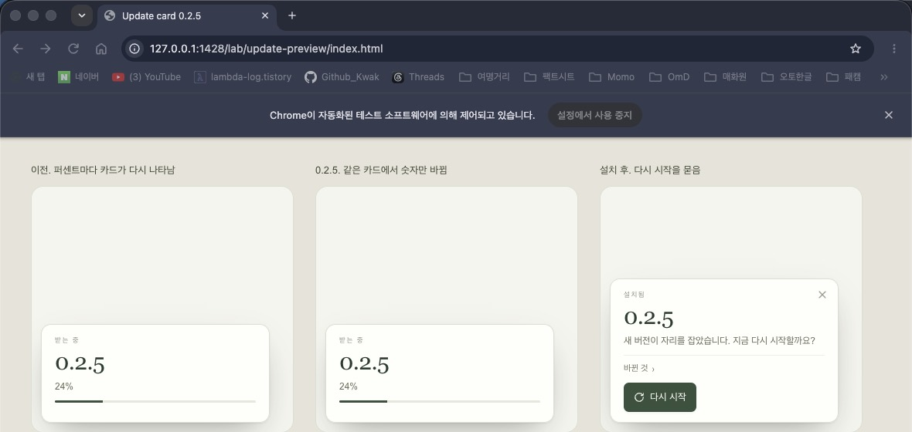
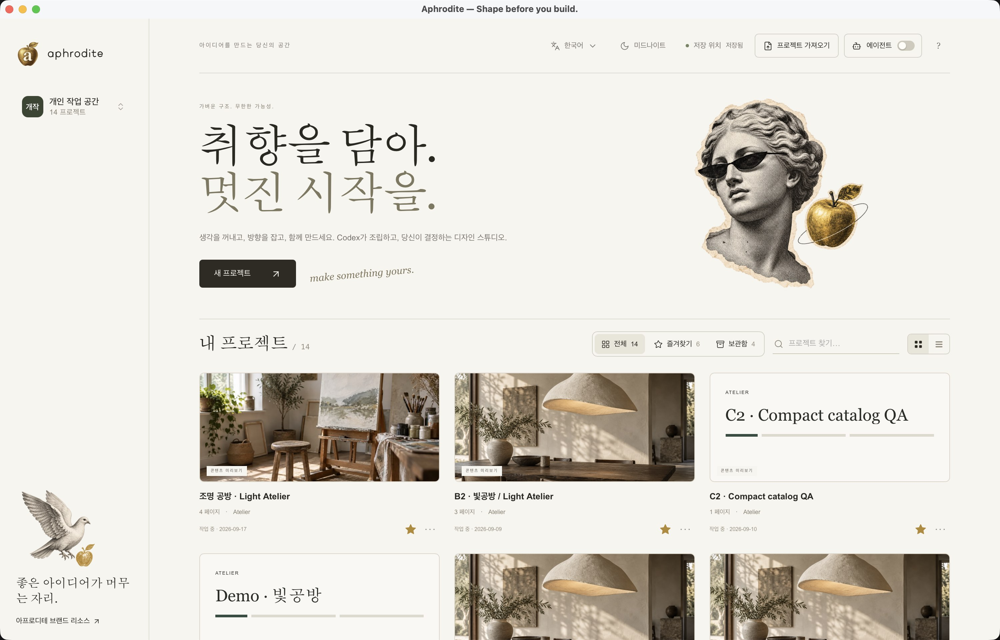
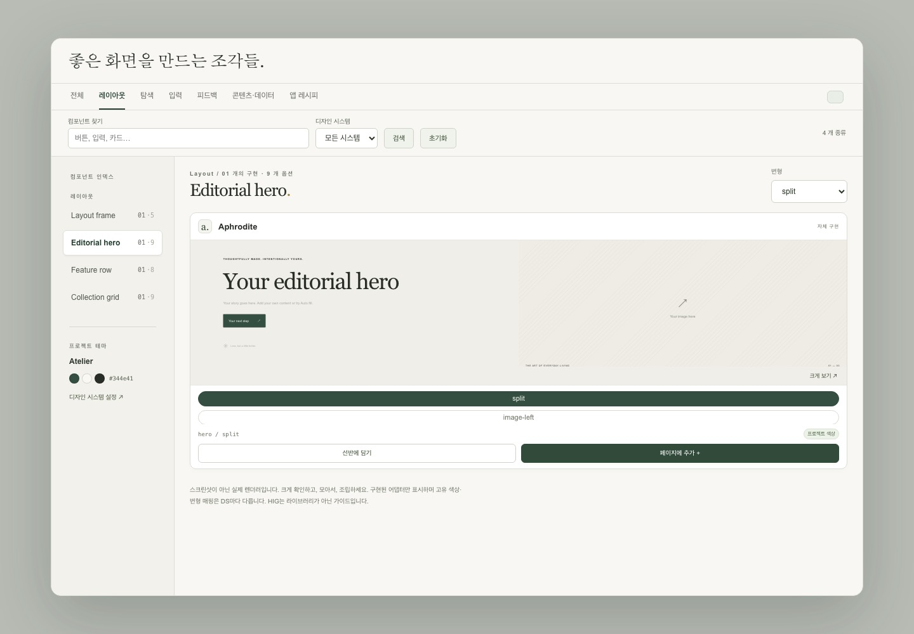
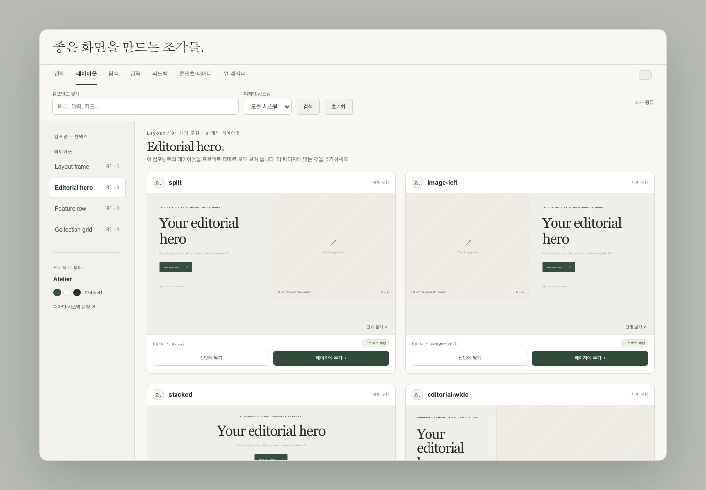

# 0.2.5 – 0.2.7 화면

설치된 `/Applications/Aphrodite.app`은 0.2.3 그대로다. 아래는 이 브랜치에서 확인한 화면이다.

## 0.2.5 업데이트 카드

다운로드가 진행돼도 카드는 그 자리에 있고, 설치가 끝나면 다시 시작할지 묻는다.

[진행 영상](025-update-card.mov)

## 0.2.6 창이 홈이면 채널도 홈

이전에는 창이 프로젝트 목록인데도 채널이 마지막 페이지를 찍어 줬다.

이후에는 계약과 화면 사진이 `screen: home`, `visible: false`만 돌려준다. 마지막 프로젝트 이름은 남고, 그 페이지는 넘기지 않는다.

## 0.2.7 레이아웃이 카드

히어로처럼 구현이 하나이고 레이아웃이 여러 개인 섹션은, 칩이 아니라 레이아웃마다 카드다.

